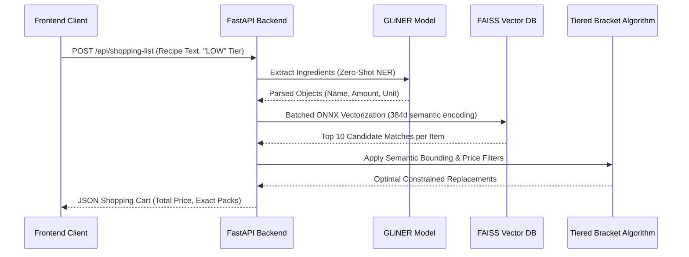
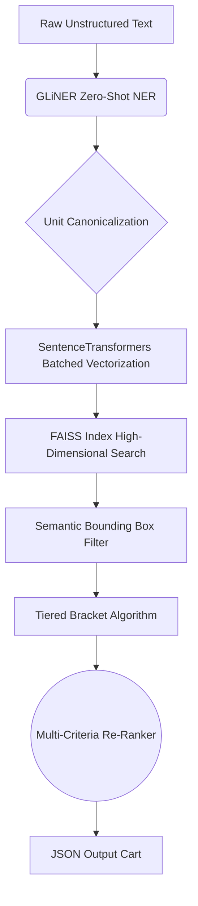

<h1 align="center">Picnic AI Recipe Builder PoC</h1>

<p align="center">
  
  
  
  
  
</p>

## Acknowledgments & Context

This project was born out of a Picnic Technologies in-house day. During discussions, the team mentioned they were actively working on an AI feature to parse user-generated recipes and automatically add the correct items to the shopping basket. I stated that a highly functional, low-latency Proof of Concept (PoC) could be constructed in a single day. 

This repository is that delivered promise. 

A massive thank you to the Picnic Technologies engineering team, and specifically to Maya Budhdeo, for providing the technical insights, context, and the opportunity to tackle this challenge. 

## The Problem Statement

Bridging unstructured human text (recipes) with structured e-commerce databases is historically difficult. Recipes contain massive semantic drift, varied and informal measurements, and absolutely no concept of brand tiering. A human reading "a bunch of carrots" intuitively knows to buy a standard 500g bag, but traditional strict keyword-matching systems will fail utterly if the catalog only lists "Washed Snack Carrots". 

Furthermore, recommending products is not just about semantic accuracy. It requires economic constraints. A user asking for "avocado" needs a system capable of differentiating between a bulk budget net, a standard ripe unit, and a premium organic variant based upon dynamic pricing tiers.

## System Architecture

> Objective: Sub-600ms API inference times mapping unstructured text to a financially constrained basket.

### Client-Server Flow



### Internal Processing Pipeline



## Technical Deep Dive & Justifications

### FastAPI with Lifespan Context
Machine learning models (PyTorch tensors, ONNX pipelines) and vector databases (FAISS) are exceptionally heavy to load. By trapping these initializations purely within the FastAPI `lifespan` sequence, the models reside persistently in system RAM (or VRAM). This eliminates the devastating cold-start penalty, allowing real-time HTTP requests to achieve sub-600ms latency without asynchronous locking.

### GLiNER (gliner_small-v2.1)
Traditional NLP layers like SpaCy require rigid fine-tuning to detect edge-case culinary entities. In contrast, routing every request to a massive cloud LLM introduces unacceptable latency and API costs. GLiNER provides a perfect middle ground: lightweight, local, zero-shot Named Entity Recognition. It autonomously extracts and cleans ingredients, quantities, and fractional measurements instantly on the CPU.

### SentenceTransformers & FAISS
To solve the semantic drift problem, string matching was completely abandoned. Instead, the catalog is mapped utilizing the `all-MiniLM-L6-v2` transformer. Every catalog item is translated into a 384-dimensional mathematical vector. 

At runtime, user ingredients are vectorized and mapped against the index using FAISS (Facebook AI Similarity Search). This allows the execution of highly optimized C++ matrix searches against the catalog, meaning the AI natively understands that "Iceberg Lettuce" is an almost identical mathematical proximity to "Romaine", silently ensuring smart substitutions rather than failing the request.

### The Semantic-Bounded Price Sort (Tiered Bracket Algorithm)
Handling the "Budget Tier" requirement is complex. If a system simply sorts the FAISS results by price, a request for "Chicken Breast" might return "Chicken Bouillon Cubes" purely because they are cheaper and share the word "chicken".

To resolve this, the pipeline executes a Semantic Bounding Box. It extracts the absolute highest cosine similarity score from the FAISS candidates ($S_{max}$). It then immediately drops any candidate whose score falls below 90% of that top match. 

This creates a highly-filtered, semantically pristine pool of essentially identical products (e.g., Budget Avocado, Standard Avocado, Premium Avocado). 
For the `LOW` and `HIGH` tiers, the Re-Ranker is completely bypassed. The system runs a raw `argmin` or `argmax` over the bounded pool unit prices to ensure absolute adherence to the requested economic constraint without sacrificing semantic accuracy.

## Project Structure

```text
├── .venv/
├── build_index.py
├── data/
│   ├── articles.json
│   └── index/
│       ├── article_ids.json
│       └── faiss.index
├── frontend/
│   ├── index.html
│   ├── main.js
│   └── style.css
├── onnx_model/
├── pyproject.toml
├── run.py
└── src/
    ├── __init__.py
    ├── api.py
    ├── matcher.py
    ├── models.py
    ├── parser.py
    ├── pipeline.py
    ├── reranker.py
    └── solver.py
```

## Getting Started

### Prerequisites
Ensure you have Python 3.11+ installed. 

### Installation

1. Clone the repository block:
```bash
git clone https://github.com/Coflazo/Picnic-Technologies-Recipe-Builder.git
cd Picnic-Technologies-Recipe-Builder
```

2. Create and activate a pristine Python virtual environment:
```bash
python3 -m venv .venv
source .venv/bin/activate
```

3. Install the dependencies utilizing `pip`:
```bash
pip install -r requirements.txt
```

> Note: If building the FAISS index on macOS, ensure you prefix your scripts with `TOKENIZERS_PARALLELISM=false` to prevent internal process deadlocks from Hugging Face's tokenizer module.

### Running the Server

Execute the bootstrapper:
```bash
python run.py
```

The server will eagerly load the 384-dimensional vector database, initialize the ONNX engine, and attach to port 8000. 

## API Reference

The primary endpoint processes unstructured recipes and returns normalized catalog matching JSON arrays.

### HTTP POST Request

```bash
curl -X POST http://localhost:8000/api/shopping-list \
  -H "Content-Type: application/json" \
  -d '{
    "recipe_text": "I need 1 ripe avocado for a salad",
    "price_tier": "low"
  }'
```

### Response

```json
{
  "items": [
    {
      "ingredient_name": "ripe avocado",
      "article": {
        "Article_ID": "ART-0135",
        "Raw_Name": "Avocado Net (Unripe)",
        "Brand": "Picnic Basic",
        "Price": 2.5,
        "Quantity_Value": 700.0,
        "Quantity_Unit": "g",
        "Description": "Budget net of smaller, firm avocados. Needs ripening at home.",
        "Price_Per_Unit": 0.0035
      },
      "match_confidence": 0.6512,
      "packs_needed": 1,
      "total_quantity": 700.0,
      "total_quantity_unit": "g",
      "total_price": 2.5,
      "price_tier": "low",
      "is_optional": false
    }
  ],
  "total_cost": 2.5,
  "price_tier": "low",
  "recipe_text": "I need 1 ripe avocado for a salad",
  "parsed_ingredients_count": 1
}
```

## Closing Thoughts

Building scalable AI requires rigorous adherence to execution speed, and prioritizing robust constraints logic over arbitrary prompt engineering.

Thank you again to Maya Budhdeo and the entire Picnic team for the challenge.
